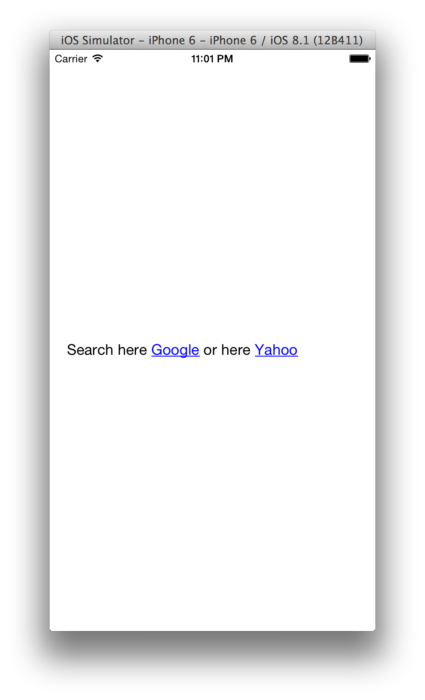

# Search and replace HTML anchor tags

## Install

- Run `pod install`
- Open `UILabelLinkReplace.xcworkspace`
- Make sure `Swift.h` is connected in Build Settings > Objective-C Bridging Header
	- Important for getting TTTAttributedLabel to work properly
	
## Example

- See screenshot below
- Tapping links will open respective link

